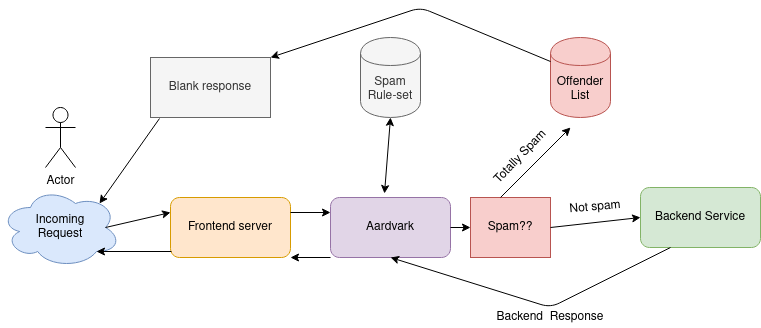

# infrastructure-aardvark-proxy
Aardvark Proxy Middleman

This service acts as a middleman between frontend web servers and ticket submission services such as JIRA or BugZilla, and intercepts all data sent.
Data is scanned for known offending words that are common in spam, and blocks the request if such are found.

## Settings:

- `proxy_url`: The backend service to proxy to if request is sane
- `spamurls`: Specific honey-pot URLs that trigger a block regardless of the action
- `ignoreurls`: Specific URLs that are exempt from spam detection
- `postmatches`: A list of keywords and/or regexes that, if matched, will block the request
- `multimatch`: A combination blocker. If a `required` keyword or regex is matched, the request will be blocked only if one or more `auxiliary` keywords/regexes are also matched

## Pipservicing

To enable as a pipservice, add the following minimal hiera yaml to your node config:

~~~yaml
pipservice:
  aardvark-proxy:
    tag: main
~~~
